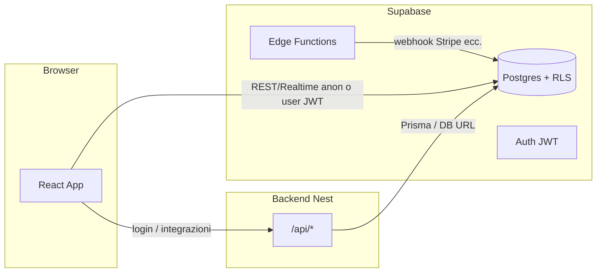

# Architettura: ruoli, route e flussi dati

Documento di onboarding e audit: **chi** usa **cosa** tra browser, Supabase (anon / authenticated) e backend Nest (`VITE_API_URL`).

## Panoramica

| Layer | Tecnologia | Ruoli tipici |
|--------|------------|----------------|
| Frontend | React + Vite (`src/`) | Tutti |
| DB + Auth + Realtime | Supabase (`VITE_SUPABASE_URL`, chiave **anon** lato client) | Pubblico, staff, admin tenant, superadmin (via JWT/session) |
| API REST aggiuntiva | Nest + Prisma (`server/pizzeria-backend`, `VITE_API_URL`) | Dove integrato (auth/login, estensioni) |

**Regola:** dati tenant e RLS restano su **Supabase**; il backend Nest copre ciò che non passa dal client diretto (segreti server-side, logica centralizzata).

## Mappa ad alto livello

## Percorsi prodotto (macro)

| Area | Route / entry | Dati principali |
|------|----------------|-----------------|
| Pubblico / vetrina | `/`, `/negozio`, carrello, checkout | Supabase anon + policy (es. menu pubblico), RPC ordini |
| Cliente autenticato | `/cliente/*`, ordini | Supabase `authenticated` + tabelle `clienti` / ordini |
| Admin tenant | `/admin/*` | Supabase staff JWT, viste `public`/`core`, settings |
| Operativo | `/operative/*`, cassa, cucina | Supabase + realtime; cassa usa RPC e turni |
| Super Admin | `/superadmin/*` | Supabase + ruoli `superadmin` in `utenti_ruoli` |

Dettaglio route: `src/router/AppRouter.jsx` e layout (`AdminLayout`, `PublicLayout`, `SuperAdminLayout`).

## Variabili ambiente (frontend)

| Variabile | Uso |
|-----------|-----|
| `VITE_SUPABASE_URL` | Endpoint progetto Supabase |
| `VITE_SUPABASE_ANON_KEY` | Solo operazioni consentite da RLS; mai `service_role` nel bundle |
| `VITE_API_URL` | Base URL Nest (`apiClient` in `src/app/api/client.js`) |
| `VITE_SENTRY_DSN` | Opzionale; errori frontend (`src/utils/initSentry.js`). Non inviare PII senza policy privacy |

## Strumenti nel codice

- Errori Supabase centralizzati: `src/utils/logSupabaseError.js`, `unwrapSupabase` in `src/utils/supabaseResult.js`.
- Errori HTTP verso Nest: `logHttpError` nello stesso modulo, interceptor in `src/app/api/client.js`.
- OpenAPI backend: quando abilitato (`SWAGGER_ENABLED` ≠ `false`), documentazione in **`/api/docs`** (Nest Swagger; prefisso globale `api`).

## Performance (note)

- Build Vite: chunk manuali per `react-router`, `@supabase`, resto (`vite.config.js`).
- Aree pesanti (cassa, lista ordini): valutare sottoscrizioni Supabase con filtri stretti, paginazione e caricamento lazy delle route (`React.lazy`) dove utile.

## Compliance (riferimento)

- Testi legali: pagine cookie/privacy/termini in `src/features/public/pages/`.
- Segreti gateway pagamenti: solo Edge / `service_role`, mai nel client (allineato agli script SQL baseline).

---

*Aggiornato: 2026-04-10*
